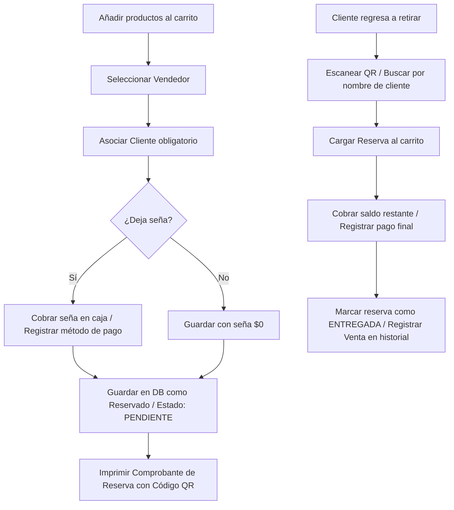
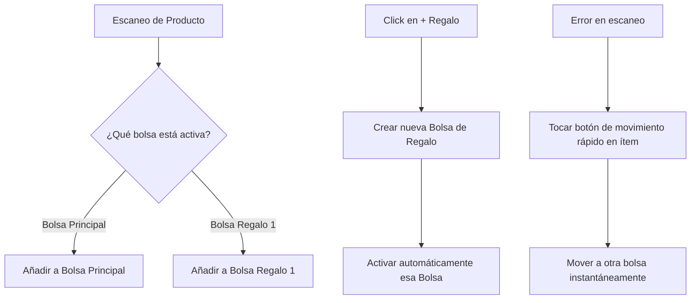

# Diseño de UX/UI y Flujo de Trabajo: Reservas y Regalos Optimizados

Este documento detalla las especificaciones de diseño, flujos de trabajo e implicaciones técnicas para la implementación de las funcionalidades de **Reservas** y el **Módulo de Regalos Optimizado** en la pantalla de Nueva Venta del POS.

---

## 1. Módulo de Reservas

El objetivo de este módulo es permitir al vendedor guardar una orden en estado pendiente de cobro y retiro, asegurando el stock físico y registrando señas (depósitos parciales).

### A. Estructura y Flujo de Trabajo (Workflow)



1. **Creación de la Reserva:**
   - El vendedor selecciona los productos y el vendedor.
   - **Cliente obligatorio:** Se añade un campo rápido de entrada de texto para asociar un Nombre y Teléfono (ej: *María Gómez - 1123456789*).
   - **Gestión de Seña (Pago parcial):**
     - Al presionar "Reservar", se pregunta si el cliente abonará una seña.
     - Si la abona, se activa temporalmente el selector de pagos (Efectivo/Transferencia) y se registra el monto del cobro parcial para impactar en la caja actual.
   - **Bloqueo de Stock:** Las prendas seleccionadas reducen el stock disponible para la venta, garantizando que el producto esté apartado físicamente.
   - **Ticket de Reserva:** Se genera una boleta que detalla los productos, el saldo pendiente de cobro y un código QR/barra identificatorio.

2. **Búsqueda y Retiro (El Botón "Reservas" de la izquierda):**
   - El botón **Reservas** abre un modal similar al de Cambios (`ExchangeDialog`).
   - El modal posee un buscador (foco automático para escáner QR o búsqueda por texto del nombre del cliente) y una lista de reservas pendientes de retiro.
   - **Acciones:**
     - `Cargar al Carrito`: Vacía el carrito actual y carga los artículos de la reserva, descontando la seña abonada como un crédito.
     - `Cancelar y Liberar Stock`: Permite dar de baja una reserva (ej: si venció el plazo de 72 horas sin retiro) y devuelve las prendas al inventario activo.

3. **Cierre de Venta (Finalizar):**
   - El carrito refleja el total original de las prendas y resta el monto de la seña.
   - Al presionar **Cobrar**, el sistema solicita el cobro únicamente del saldo restante. Al confirmarse, la reserva cambia a estado `FINALIZADA` y se registra la venta final.

---

### B. Diseño de Interfaz (UI/UX)

* **Botón en barra de cobro:**
  El botón **Reservar** se ubica justo debajo de **Cobrar** con una prioridad secundaria:
  ```tsx
  <div className="space-y-2 mt-4">
      {/* Botón Principal */}
      <Button size="lg" className="h-14 w-full rounded-2xl bg-[gradient-premium] text-white">
          Cobrar $45.000
      </Button>

      {/* Botón Secundario de Reserva */}
      <Button 
          variant="outline" 
          className="h-11 w-full rounded-xl border-dashed border-border/85 text-muted-foreground hover:text-foreground"
      >
          <Bookmark className="size-4 mr-2" />
          Guardar como Reserva
      </Button>
  </div>
  ```

---

### C. Propuesta de Base de Datos (Prisma)

Para soportar las reservas en Prisma y sincronización offline (PowerSync / SQLite), se proponen los siguientes modelos:

```prisma
model Reservation {
  id              String            @id @default(uuid())
  ticketNumber    String            @unique // Ej: RES-0001
  createdAt       DateTime          @default(now())
  updatedAt       DateTime          @updatedAt
  deletedAt       DateTime?
  expiresAt       DateTime          // Fecha de vencimiento (ej. +72hs o 30 días)
  status          ReservationStatus @default(PENDING) // PENDING, FINALIZED, CANCELLED
  
  customerName    String
  customerPhone   String?
  
  sellerId        String
  seller          User              @relation(fields: [sellerId], references: [id])
  
  totalAmount     Float             // Total original de las prendas
  downPayment     Float             @default(0) // Seña pagada inicial
  
  items           ReservationItem[]
  
  // Relación con el movimiento de caja de la seña
  cashSessionId   String?
  cashSession     CashSession?      @relation(fields: [cashSessionId], references: [id])
}

model ReservationItem {
  id              String      @id @default(uuid())
  reservationId   String
  reservation     Reservation @relation(fields: [reservationId], references: [id], onDelete: Cascade)
  variantId       String
  variant         ProductVariant @relation(fields: [variantId], references: [id])
  quantity        Int
  priceAtTime     Float
}

enum ReservationStatus {
  PENDING
  FINALIZED
  CANCELLED
}
```

---
---

## 2. Módulo de Regalos Optimizado

El objetivo de este módulo es acelerar y simplificar el agrupamiento de productos para tickets de cambio, eliminando por completo los "modos" confusos y minimizando el número de clics mediante una estructura visual basada en **"Bolsas de Regalo colapsables"**.

### A. Estructura y Flujo de Trabajo (Workflow)



1. **Bolsas en la misma Pantalla (Lista única vertical):**
   - El carrito de compras no muestra una lista plana, sino sub-listas agrupadas por "Bolsas" en la misma columna vertical.
   - **Bolsa Principal (Venta común):** Donde caen los productos por defecto.
   - **Bolsa de Regalo X:** Bolsas creadas dinámicamente para agrupar prendas de regalo independientes.

2. **Escaneo Reactivo:**
   - La cabecera de cada bolsa tiene un indicador táctil de estado activo (ej: una luz led verde `🟢` o borde brillante).
   - El cajero selecciona cuál es la bolsa activa simplemente tocando su cabecera.
   - Cualquier código de barras que escanee con la pistola se insertará directamente en la bolsa que se encuentre activa en ese momento.

3. **Colapso Inteligente (Smart Accordion):**
   - Para evitar que la pantalla se desborde con 4 o 5 regalos, las bolsas inactivas se colapsan automáticamente en una barra delgada de una sola línea (ej: `🎁 Regalo 1 - 2 art. ($20.000) [Expandir]`).
   - La bolsa activa siempre se muestra expandida con sus productos.
   - Si el cajero toca una bolsa inactiva, esta se expande y la que estaba activa se contrae, manteniendo la pantalla limpia.

4. **Acción de Movimiento Rápido:**
   - Si un producto se escaneó en la bolsa equivocada, no se requiere abrir menús desplegables.
   - Al lado del producto se muestran pequeños botones de flecha o el ícono correspondiente para moverlo directamente a las otras bolsas abiertas (ej. de Bolsa Principal a Bolsa Regalo 1 con 1 clic).

---

### B. Diseño de Interfaz (UI/UX)

Así se organiza visualmente el lateral derecho de la venta con el acordeón colapsable:

```
🛒 ORDEN ACTUAL (5 artículos)
======================================================
🟢 🛍️ BOLSA PRINCIPAL (Escaneo activo) ▾
   • Remera Estampada x 2                      $30.000
   • Medias Algodón x 1                         $5.000
   [ Mover a Regalo 1 ➜ ] [x]

======================================================
⚪ 🎁 REGALO 1 (Primo) - 1 art. ($15.000) ▸

======================================================
⚪ 🎁 REGALO 2 (Abuela) - 1 art. ($25.000) ▸

======================================================
➕ Agregar Bolsa de Regalo
======================================================
Total a cobrar: $75.000
[ COBRAR ]
```

### C. Beneficios del Flujo Colapsable
- **Sin Modos Confusos:** No hay un interruptor global de "Activar Regalos". Los regalos son simplemente divisiones naturales de la orden de compra.
- **Sin Scroll:** Al cerrarse las bolsas inactivas, todo el contenido de la compra entra holgadamente en el alto de una pantalla de tablet o monitor de mostrador.
- **Tickets de Cambio automáticos:** Al cobrar, el sistema asocia los `giftGroupLabel` de forma automática según la bolsa en la que quedó cada producto, imprimiendo un ticket de cambio por cada Bolsa de Regalo de forma transparente y sin clics adicionales.
