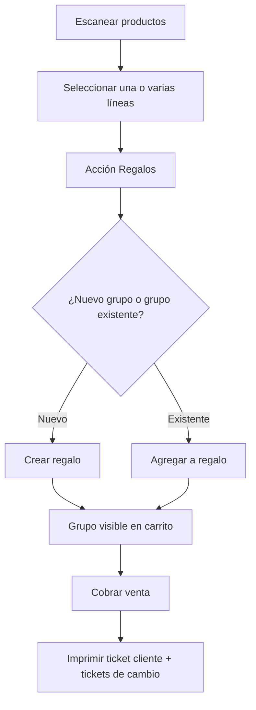

# Propuesta de mejora del flujo de regalos en Nueva Venta

Este documento propone una versión más rápida e intuitiva del flujo de regalos en la pantalla de Nueva Venta. La intención no es cambiar la lógica comercial, sino reducir fricción operativa, clics y cambio de contexto para el cajero.

---

## 1. Problema actual

Hoy el flujo de regalos depende de un modo de agrupación manual. Eso tiene tres costos claros:

- Obliga a entrar y salir de un estado especial para operar.
- Mezcla acciones de venta normal con acciones de armado de regalos.
- Hace que el carrito cambie de comportamiento, lo que aumenta el costo cognitivo.

En mostrador, eso se siente lento si el objetivo es solo marcar uno o varios productos como regalo y seguir cobrando.

---

## 2. Objetivo de la mejora

La meta es que regalar productos sea una acción contextual y no un modo global.

Principios de diseño:

- Mantener el carrito normal siempre visible y operativo.
- Evitar pantallas intermedias o modos permanentes.
- Hacer que crear o mover regalos requiera 1 a 2 acciones como máximo.
- Mantener la impresión de tickets de cambio sin cambiar la lógica final del cobro.

---

## 3. Propuesta recomendada

### A. Regalos como acción contextual por card

Cada card del carrito debe mostrar una acción clara de regalo:

- `Marcar como regalo`
- `Mover a regalo existente`
- `Quitar de regalo`

La acción vive en la tarjeta del producto, no en un modo global de la pantalla.

Si hoy el carrito ya está compuesto por cards, la selección se hace sobre esas mismas cards: una card por vez, o varias cards a la vez con un estado visual de selección.

### B. Panel lateral o drawer de regalos

Al tocar `Regalos`, se abre un panel liviano con dos bloques. La ubicación recomendada es el panel derecho de la página de venta, cerca del resumen de la orden y del área de cobro, para que no saque al cajero del contexto principal.

En ese panel aparecen dos bloques:

1. `Crear nuevo regalo`
2. `Regalos existentes`

La idea es que la acción principal siga ocurriendo dentro del carrito, pero las acciones de crear o reasignar regalos vivan en este panel de apoyo.

Por ahora conviene que el panel no muestre el detalle de cada regalo. Solo debería mostrar acciones rápidas para no alargar la UI ni duplicar información que ya vive en el carrito.

Desde ahí el cajero puede:

- Crear un grupo nuevo con nombre automático o editable.
- Agregar las cards seleccionadas a un grupo existente.
- Cerrar el panel sin perder contexto.

La regla visual más importante es que `Cobrar` siga siendo el punto de mayor peso del contenedor. Las acciones de regalo deben verse como soporte: tamaño más chico, menos contraste y agrupadas en un bloque separado para que no compitan con la acción principal.

Vista sugerida del layout, más parecida a tu UI actual y sin detalle de regalos:

```text
┌──────────────────────────────────────────────────────────────────────────────┐
│ [ Escanear código o buscar por nombre................................. ]     │
│ [ Cambio ]  [ Reservas ]  [ Crear rápido ]                                   │
├──────────────────────────────────────────────────────────────────────────────┤
│                                                                              │
│  ┌───────────────────────────────┐  ┌───────────────────────────────┐       │
│  │ CARD PRODUCTO                 │  │ CARD PRODUCTO                 │       │
│  │ nombre + subtotal             │  │ nombre + subtotal             │       │
│  │ qty  [-]  [+]   🗑            │  │ qty  [-]  [+]   🗑            │       │
│  └───────────────────────────────┘  └───────────────────────────────┘       │
│  ┌───────────────────────────────┐  ┌───────────────────────────────┐       │
│  │ CARD PRODUCTO                 │  │ CARD PRODUCTO                 │       │
│  │ nombre + subtotal             │  │ nombre + subtotal             │       │
│  │ qty  [-]  [+]   🗑            │  │ qty  [-]  [+]   🗑            │       │
│  └───────────────────────────────┘  └───────────────────────────────┘       │
│                                                                              │
│                                          ┌──────────────────────────────┐    │
│                                          │ ORDEN ACTUAL                 │    │
│                                          │                              │    │
│                                          │ [ Gift / Vaciar ]            │    │
│                                          │ [ Precio venta / Mayorista ] │    │
│                                          │ [ Vendedor: 1 2 3 ]          │    │
│                                          │                              │    │
│                                          │ Items: 4                     │    │
│                                          │ Total a cobrar: $....        │    │
│                                          │                              │    │
│                                          │ [ Crear regalo ]             │    │
│                                          │ [ Agregar a regalo ]         │    │
│                                          │ [ Quitar selección ]         │    │
│                                          │                              │    │
│                                          │      [ COBRAR ]              │    │
│                                          └──────────────────────────────┘    │
└──────────────────────────────────────────────────────────────────────────────┘
```

### C. Selección rápida con confirmación explícita

Si el usuario selecciona una o varias cards, el panel muestra una acción primaria:

- `Crear regalo con 3 productos`

Si ya hay un grupo creado, la misma zona del panel puede cambiar a `Agregar a regalo` sin listar todos los grupos. Eso mantiene la superficie chica y evita que el contenedor crezca cuando hay más de un regalo.

Esto reduce la fricción respecto a un modo manual porque la selección siempre termina en una acción concreta.

La acción principal de `Cobrar` no debería moverse ni perder protagonismo cuando aparezcan estas acciones. Si hace falta, las acciones de regalo pueden vivir en un bloque superior más chico, mientras `Cobrar` ocupa la base del panel con más ancho, más altura y más contraste.

### D. Resumen compacto en el carrito

Por ahora conviene no mostrar ningún bloque de detalle en el panel derecho. Si más adelante se necesita revisar regalos, eso puede vivir en otro componente o en un modal aparte.

Esto hace que el panel derecho se mantenga corto y que el foco quede en el gesto rápido: seleccionar cards y ejecutar una acción.

---

## 4. Flujo propuesto



---

## 5. Por qué esta versión puede ser mejor

Esta propuesta mejora el documento anterior en tres puntos:

- Reduce la dependencia de un modo especial permanente.
- Se adapta mejor a ventas rápidas, porque el flujo normal no se interrumpe.
- Hace más obvio qué está pasando con cada línea del carrito.

En términos de UX, la clave es que el usuario no tenga que pensar si está “activando regalos” o “desactivándolos”. Solo elige una acción concreta sobre los ítems que ya tiene delante.

---

## 6. Tradeoffs

Esta opción también tiene costos:

- Requiere ajustar la UI de las tarjetas del carrito.
- Puede necesitar un panel lateral o drawer nuevo.
- Si se quieren muchas acciones inline, hay que cuidar que la tarjeta no quede cargada.

Por eso conviene priorizar una sola entrada al flujo de regalos, no varias.

---

## 7. Recomendación final

Si se busca rapidez real en mostrador, la mejor dirección no es mejorar el modo manual actual, sino reemplazarlo por un flujo contextual con un panel de regalos y acciones directas por línea.

La versión con “bolsas colapsables” es útil como representación visual, pero la versión más fuerte en UX es la que elimina el modo especial y deja los regalos como una operación natural sobre el carrito.

---

## 8. Dos variantes de panel

### A. Variante compacta para tablet

Pensada para que el panel derecho nunca compita con el área de cards.

- Solo muestra acciones rápidas.
- No enseña detalle de regalos.
- El botón principal sigue siendo `Cobrar`.

Ejemplo:

```text
┌──────────────────────────────┐
│ ORDEN ACTUAL                 │
│                              │
│ Items: 4                     │
│ Total: $....                 │
│                              │
│ Regalos                      │
│ [ Crear regalo ]             │
│ [ Agregar a regalo ]         │
│ [ Quitar selección ]         │
│                              │
│           [ COBRAR ]         │
└──────────────────────────────┘
```

### B. Variante más cómoda para escritorio

Pensada para monitores más anchos, donde el panel derecho puede tener un poco más de aire sin crecer demasiado.

- Las acciones de regalo van arriba del botón de cobrar.
- No hay resumen ni detalle de regalos en el panel.
- Las acciones se mantienen visibles, pero compactas.
- El botón de cobrar sigue al final como cierre natural.

Ejemplo:

```text
┌──────────────────────────────────┐
│ ORDEN ACTUAL                     │
│                                  │
│ Items: 4                         │
│ Total: $....                     │
│                                  │
│ Regalos                          │
│ [ Crear regalo ]                 │
│ [ Agregar a regalo ]             │
│ [ Quitar selección ]             │
│                                  │
│           [ COBRAR ]             │
└──────────────────────────────────┘
```

### C. Regla práctica para elegir

Si el uso principal va a ser tablet o mostrador estrecho, conviene la variante compacta.

Si el uso principal va a ser desktop con más ancho disponible, conviene la variante de escritorio.

En ambos casos la regla clave se mantiene: no mostrar detalle de regalos en el panel, solo acciones rápidas, y mantener `Cobrar` como la acción más visible y más fácil de alcanzar.
